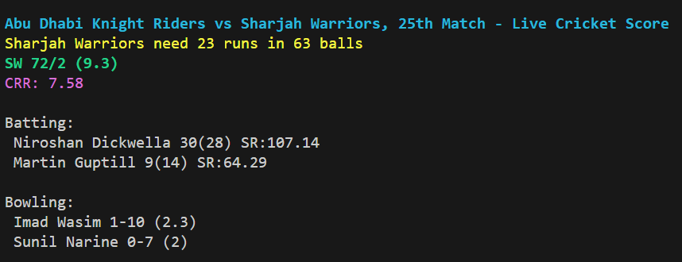

## CrickCLI 
Terminal companion for live cricket scores and stats, keeping users in the game with speed and simplicity, powered by Go.




### Directory Structure:
```
cricCLI/
|-- cmd/    
|   |-- root.go          // Main command logic
|   |-- edit.go          // Edit command logic
|-- internal/
|   |-- config/
|       |-- config.go    // Configuration handling
|   |-- cricklib/
|       |-- cricklib.go  // Live cricket score logic
|-- pkg/
|   |-- http/
|       |-- client.go    // HTTP client abstraction
|-- tests/
|   |-- cricklib/
|       |-- cricklib_test.go // Unit tests for cricklib package
|-- go.mod
|-- go.sum
|-- main.go
|-- README.md
```

### Build
```
go build -o crickCLI
```

### Run
If using for the first time, you need to set a match ID first, which can be found [here](https://github.com/prajjwalyd/crickCLI/blob/main/docs/matchID.md).

```
./crickCLI edit
```

After setting the match ID once, you can edit it anytime using the same commands.

To see the live score:
```
./crickCLI
```

This command will fetch and display the live score of the set match ID.

### Run Without Build
```
go run main.go edit
```
